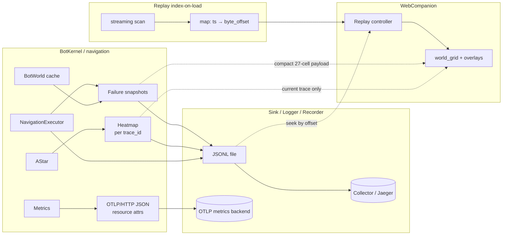

# Observability & Diagnostics Roadmap

This document outlines a multi-stage plan to evolve the bot from its current trace-correlated JSONL + optional OTLP trace export model toward a professional-grade telemetry and post-mortem debugging stack.

## Current State vs Future State

| Area              | Current State                                                                                                                                              | Future State                                                                                                                                                                                            |
| ----------------- | ---------------------------------------------------------------------------------------------------------------------------------------------------------- | ------------------------------------------------------------------------------------------------------------------------------------------------------------------------------------------------------- |
| **Correlation**   | `trace_id` via `AsyncLocalStorage` (`traceContext.ts`); attached on JSONL sink rows and navigation telemetry                                               | Same correlation id propagated into OTLP metrics, failure snapshots, and replay scrubber state                                                                                                          |
| **Metrics**       | `Metrics` (`Metrics.ts`) holds in-process counters, position trail, and rolling counter samples for short windows; exposed through kernel/status, not OTLP | Counters and derived rates (blocks/min, distance/min) exported as **OTLP/HTTP (JSON)** metrics on a schedule, same `TELEMETRY_ENDPOINT` convention as traces (typical local collector on port **4318**) |
| **Traces**        | `debugLog` posts OTLP JSON traces to `{TELEMETRY_ENDPOINT}/v1/traces` (Jaeger-compatible)                                                                  | Traces remain; metrics use `/v1/metrics` (or configured sibling path) under the same base URL convention                                                                                                |
| **Failures**      | `movement_fail` JSONL events carry `MovementFailPayload` (`reason`, `observed`, `phase`, etc.)                                                             | Same events plus a structured 3×3×3 block snapshot around the failure anchor for “why” context                                                                                                          |
| **Web Companion** | 16×16 worldview grid, logs, fleet status, path overlays where applicable                                                                                   | Failure snapshot viewer, replay transport controls, A\* expansion heatmap overlay                                                                                                                       |
| **Replay**        | `pumpReplayFile` reads entire JSONL into memory and replays linearly into `UiEventBus` + `ReplayState`                                                     | **Index-on-load** (`timestamp → byte_offset`) then O(1) seek; transport controls; grid synced to replay clock                                                                                           |

---

## Data Flow (Target Architecture)

High-level flow from runtime through sinks to the Web Companion after the initiatives below.

---

## Initiative 1: Time-Series Metrics Export (OTLP Metrics)

**Goal:** Move beyond local counters and ad-hoc snapshots to historical trend analysis in standard observability backends.

**Tasks**

- Extend `Metrics` (or a thin `MetricsExporter` collaborator used from `BotKernel` / `Telemetry`) to aggregate gauge and counter-style signals and emit **OTLP/HTTP with JSON encoding** (same wire style as existing trace export) to `{TELEMETRY_ENDPOINT}/v1/metrics`, keeping alignment with typical OTLP HTTP collectors on port **4318** alongside Jaeger-style trace ingestion.
- Define stable metric names and data-point attributes (e.g. `mode`) for “efficiency” signals: blocks dug per minute, horizontal distance per minute, derived from existing counters and `windowCounterDelta` / position trail where appropriate.
- Wire periodic export (respecting rate limits) when `TELEMETRY_ENDPOINT` is set; keep behavior unchanged when unset.

**Technical Success Criteria**

- With `TELEMETRY_ENDPOINT` configured, a collector can scrape or receive metrics and graphs show non-zero series during active mining / movement without manual code changes to dashboards.
- Metric export failures do not break the bot process (errors follow existing tuple / non-throwing patterns used elsewhere).
- Documented mapping from in-process `Metrics` keys to exported OTLP metric names appears in README or config comments only if the team already documents env vars there; otherwise keep env schema aligned in `bot.ts` schema.

### Implementation Notes / Technical Guardrails

- **Encoding:** All metric exports use **OTLP/HTTP (JSON)** only (no protobuf on the wire for this codebase path), matching the existing `debugLog` trace pipeline so operators can reuse the same collector base URL and JSON-oriented tooling.
- **Resource attributes:** Every `ResourceMetrics` (or equivalent) payload must include **`service.name`** (aligned with `TELEMETRY_SERVICE_NAME` / existing trace resource) and **`bot_id`** as **resource** attributes so Grafana and other backends can aggregate and split multi-bot fleets without overloading per-series attribute cardinality.

---

## Initiative 2: Rich Failure Context (“Why” Snapshots)

**Goal:** At the instant of a navigation or movement validation failure, capture enough world context to explain _why_ the executor disagreed with the plan.

**Tasks**

- On `NavigationExecutor` failure paths (including reasons such as `post_foot_mismatch` and related validator outcomes), sample a 3×3×3 block volume centered on the relevant foot / action anchor by **reading only from the existing `BotWorld` (or equivalent) in-memory cache** already maintained for navigation—no new synchronous Mineflayer/world queries on the failure path.
- Extend `movement_fail` emission (`NAV_EVENT.MOVEMENT_FAIL`, `MovementFailPayload` in `Events.ts`) so JSONL rows include a compact, versioned snapshot object (see guardrails below) suitable for storage and UI.
- Update the Web Companion to parse and render “Failure Snapshots” (e.g. layered mini-grid or modal) tied to the selected log line or latest failure for the active bot.

**Technical Success Criteria**

- Every emitted `movement_fail` for instrumented failure reasons includes a snapshot when world data is available; size bounded and schema stable across a minor version.
- Replay of a JSONL file containing snapshots reproduces the same UI representation as live mode.
- Snapshots do not add noticeable tick-time stalls (sampling batched or pulled from already-synced world caches).

### Implementation Notes / Technical Guardrails

- **Performance:** The 27-cell sample must be assembled exclusively from data already present in the navigation world cache (`BotWorld`); if a cell is not yet cached, record `unknown` / omit in the compact encoding rather than blocking the main loop on a fresh query.
- **Serialization:** Prefer a **palette table + indices** (27 small integers) or a **bit-packed / bitmask-oriented** layout where movement classes or block families allow it, plus a schema version field—goal is minimal JSONL growth versus 27 full block name strings per failure.

---

## Initiative 3: Interactive Replay Dashboard

**Goal:** Enable time-travel debugging: scrub through a session after the fact with the worldview aligned to what the bot “saw.”

**Tasks**

- Replace or augment `pumpReplayFile` so replay is not strictly one-shot full-file: implement **index-on-load**—a single streaming pass builds a **`timestamp → byte_offset`** map (and optionally line numbers) without holding the full file contents in RAM; seeking uses `fs.createReadStream` + `stream` seek or partial reads from stored offsets, then re-applies events from a checkpoint (may require `ReplayState` snapshot / reset semantics).
- Add a Replay Controller in the Web Companion: play, pause, rewind, fast-forward, and scrubber bound to replay timeline.
- Drive `world_grid` (and path overlays) from the replay cursor timestamp so grid state matches the event stream at that instant.

**Technical Success Criteria**

- Scrubbing backward then forward produces consistent `ReplayState` and grid visuals for the same timestamp.
- Large JSONL files remain usable (no full-file duplicate in memory where avoidable, or documented memory tradeoff).
- Existing `REPLAY_JSONL` entry path in `main.ts` continues to work for simple “play through once” until the UI requires seek (backward compatible).

### Implementation Notes / Technical Guardrails

- **Memory:** Use **index-on-load**: first pass scans the file sequentially, parses only enough of each line to extract a monotonic `ts` (or sort key) and records the **starting byte offset** of that line; the index is bounded by line count, not file size in bytes beyond the map structure.
- **Seeking:** Jumping to a timestamp is **O(1) map lookup** to an offset, then bounded forward read + JSON parse for events from that cursor—not reloading a multi-gigabyte string into memory (contrast with today’s full `readFile` + `split('\n')` pattern in `pumpReplayFile.ts`).

---

## Initiative 4: Pathfinding Heatmaps & Heuristic Analysis

**Goal:** Visualize A\* search effort in real time, not only the final path, and highlight pathological search regions.

**Tasks**

- During search, record expanded nodes (building on `NAV_EVENT.NODE_EXPAND` / `Recorder` telemetry) into a bounded spatial structure suitable for the 16×16 companion (aggregate per-cell expansion count for the **active** `trace_id` only).
- Overlay expansion counts on the Web Companion worldview (color or alpha heatmap) **scoped strictly to the current `trace_id`** so prior walks do not clutter the overlay.
- Emit a diagnostic when a **heuristic trap** is detected: if **(expanded node count) / max(1, Manhattan distance from search start to goal)** **>** **X**, fire once per search (or throttled); default **X = 50**. Surface via JSONL and/or low-rate `debugLog` with `expanded`, `manhattan`, `X`, and `runId` / `trace_id`.

**Technical Success Criteria**

- For a single `search_start` … `search_end` cycle, the UI can show both final path and expansion heatmap without leaking unbounded memory across ticks.
- Heuristic-trap signals correlate with known bad cases (tight caves, headroom failures) in manual test scenarios.
- Heatmap data path reuses existing telemetry / status channels where possible to avoid duplicate A\* instrumentation.

### Implementation Notes / Technical Guardrails

- **Heuristic trap definition:** Use the ratio **expansions / Manhattan(start, goal)** with **default threshold X = 50**; tune X via config if needed. Document that Manhattan uses the same coordinate convention as the planner’s goal specification.
- **Visualization bounds:** The heatmap buffer and UI overlay must **clear or ignore expansions from any prior `trace_id`** when a new walk starts; only the current correlated walk’s cells are painted.

---

## Suggested Phasing

1. **Phase A — Export:** Initiative 1 (metrics) + minimal README / env documentation for metrics path.
2. **Phase B — Context:** Initiative 2 (failure snapshots) + Web Companion read path.
3. **Phase C — Replay UX:** Initiative 3 (seekable replay + controller).
4. **Phase D — Planner insight:** Initiative 4 (heatmaps + heuristic traps).

Dependencies: Initiative 2 benefits from stable JSONL schema patterns established in 1; Initiative 3 can reuse snapshot and trace metadata from 2 for richer scrub labels; Initiative 4 is largely parallel but shares Web Companion overlay plumbing with 2 and 3.
