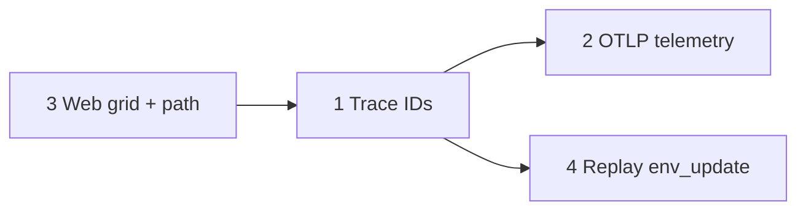

# Observability roadmap: decision context over flat logs

## Why this exists

The bot is **highly stateful** and runs **dense algorithms** (notably A* pathfinding). The existing stack—JSONL event sink (`Sink`), structured `Logger.decision` / `Logger.event`, and the local web companion—is a strong baseline. **Flat, unrelated log lines** still make it hard to answer: *why did this navigation fail, and what goal caused this specific `jump_up`?\*

This document turns four improvement directions into **scoped initiatives**: trace correlation, configurable remote telemetry, live worldview visualization, and replay-time environmental context.

---

## Current anchors (what already works)

| Piece                                                                        | Role                                               |
| ---------------------------------------------------------------------------- | -------------------------------------------------- |
| `src/shared/Logger.ts`                                                       | `decision` / `event` → JSONL via sink + console/UI |
| `src/shared/Sink.ts` (and related)                                           | Structured JSONL persistence                       |
| `src/web/WebCompanion.ts`                                                    | Local dashboard / WebSocket companion              |
| `src/shared/debugLog.ts`                                                     | Fire-and-forget POST to a fixed local ingest URL   |
| `src/replay/pumpReplayFile.ts`, `src/replay/ReplayState.ts`                  | Replay of fleet movement                           |
| `src/navigation/world/BotWorld.ts`, collision helpers                        | Internal block / movement-class representation     |
| `src/modes/GuidedMode.ts`, `src/skills/Navigator.ts`, `NavigationController` | User targets → walk → navigation pipeline          |

Use this table when scoping tasks so new data lands in **one obvious place** (JSONL shape, WS messages, or OTLP).

---

## Initiative 1 — Span-based tracing (trace IDs through the stack)

### Goal

Correlate every navigation-related event with a **single Navigator invocation**, from that call through planner validation and primitive movement, including multi-bot runs.

### Resolved scope

- **One new `trace_id` per `Navigator` walk/navigation call** (each distinct call gets its own trace; replans or follow-on work inside that call share the same ID until the call completes).

### Design sketch and technical constraints

1. **Generate a trace ID** at the **start of each `Navigator` call** that kicks off pathfinding / movement (enter `AsyncLocalStorage` there so everything downstream inherits context).
2. **Thread context using `AsyncLocalStorage`:** To avoid large refactors and prop-drilling through `Navigator` → `NavigationController` → A\*, use Node’s `node:async_hooks` `AsyncLocalStorage` to hold the active trace context.
3. **Emit `trace_id` on JSONL records.** Extend `Logger.ts` so `event()` and `decision()` automatically attach the current `trace_id` from `AsyncLocalStorage` when it exists. Ensure `sink.writeEvent` carries `trace_id` as a first-class field (not only nested under `data`).

### Implementation checklist

- Add a small module that **enters** trace context around **each `Navigator` call** and exposes `getTraceId()` (or equivalent) for code that must read explicitly.
- Document the lifecycle rule above next to the enter/exit sites so future modes do not fork ad-hoc IDs.
- Add one **integration-style check**: trigger a failed plan and confirm correlated JSONL lines share the same `trace_id`.

### Success criteria

- From any `navigation` failure line in JSONL, you can list **all** correlated decisions/events for **that Navigator call** without guessing timestamps.
- Multiple bots: IDs do not collide with bot identity; logs remain filterable by `botId` **and** `trace_id`.

---

## Initiative 2 — Remote telemetry: configuration + OpenTelemetry-friendly payloads

### Goal

Stop hardcoding ingest URL and session identity; allow pointing the bot at **Jaeger, Zipkin, Grafana Tempo**, or any OTLP-compatible collector without fork-patching.

### Resolved stack

- **Local target:** run **Jaeger all-in-one** via Docker (`jaegertracing/all-in-one`); point `TELEMETRY_ENDPOINT` (or OTLP URL vars you define) at that container’s OTLP HTTP/gRPC ports as documented for the image version you pin. Use the Jaeger UI (default port **16686**) for waterfalls during development.

### Current state

`src/shared/debugLog.ts` uses a fixed `ENDPOINT` and `SESSION` constant.

### Implementation checklist

- Add env-driven config (e.g. `TELEMETRY_ENDPOINT`; session or resource attrs as needed)—wire through `src/config/`.
- Gate sends when unset (no network noise in dev).
- Map outbound payloads toward **OpenTelemetry** semantics (structured JSON mapping first). Evaluate `@opentelemetry/sdk-trace-node` when spans need standard export instead of hand-rolled mapping.
- Validate against the **Jaeger all-in-one** container before worrying about hosted collectors.

### Success criteria

- Changing `.env` alone redirects telemetry; no code edits required for URL/session.
- A collector can build a **waterfall** view once spans are emitted at the right boundaries.

---

## Initiative 3 — Web companion: “worldview” grid + path overlay

### Goal

Explain confusing choices by showing **what the bot thought the world was** (movement classes) and **what path the planner considered**, not only text logs.

### Resolved scope

- **Grid payload:** each cell is **movement class only** (same abstraction the navigator uses for collision / traversability—no block names or IDs in v1).

### Implementation checklist

1. **Local grid broadcast** — From `WebCompanion.ts`, emit a small fixed footprint (e.g. 16×16) **top-down** snapshot around the focused bot. **Throttle:** emit the **full grid on focus change**; afterward emit **diffs or updates only when the bot enters a new block column** (or equivalent coarse step) so WebSocket traffic stays bounded.
2. **Path overlay** — When `NAV_TRACE=1`, subscribe navigation internals to emit `NAV_EVENT.PATH_SELECTED` and `NAV_EVENT.CANDIDATE_REJECTED` over the WebSocket.
3. **Dashboard HTML/JS** — Draw the planned route and rejected nodes **on top of** the grid.

### Success criteria

- Without reading JSONL, you can see **stuck** vs **alternate route chosen** vs **rejected candidates** for the focused bot visually.

---

## Initiative 4 — Replay: environmental context (`env_update`)

### Goal

Replay answers not only _where the bot went_ but _what changed around it_ that could explain stops or path failures.

### Implementation checklist

- Listen for **`blockUpdate`** within a short radius of the controlled entity.
- **Filter aggressively:** only emit updates inside a strict bounding box (e.g. **8 blocks**); skip changes that do not affect navigation unless they alter a **`MovementClass`** (or equivalent collision-relevant classification).
- Write compact JSONL events (`env_update`) with position, block identity, and `trace_id`.
- Extend replay ingestion (`pumpReplayFile.ts` / `ReplayState.ts`) to cross-reference `env_update` streams on a unified timeline.

### Success criteria

- You can answer retroactively: “Did this fail because a block appeared, a pit opened, or chunk data lagged?” with evidence on the same timeline as movement.

---

## Ordering and dependencies

- **T3 → T1:** Ship the grid and path plumbing first if that unblocks **real-time** debugging; **then** thread `trace_id` through companion payloads and JSONL so overlays and logs align on one correlation key (one ID per `Navigator` call).
- **T1 → T2:** Trace context feeds OTLP spans and attributes without ad-hoc stitching.
- **T1 → T4:** `env_update` lines stay attributable to the **trace for that `Navigator` call** via `trace_id`.

---

## Product priority

- **Real-time debugging first:** prioritize Initiatives **1–3** (live correlation, telemetry waterfalls, companion worldview) ahead of Initiative **4** (replay `env_update`), unless a specific post-mortem forces **4** earlier.

---

## Choosing where to start

| If your pain is…                                      | Start with…                   |
| ----------------------------------------------------- | ----------------------------- |
| “I cannot connect failure to the goal that caused it” | **1** (trace IDs), then **2** |
| “I need to _see_ wrong worldview vs server”           | **3**                         |
| “Post-mortems after the fact”                         | **4**, ideally after **1**    |

---

## Resolved decisions (formerly open questions)

| Topic               | Decision                                                                          |
| ------------------- | --------------------------------------------------------------------------------- |
| Real-time vs replay | **Real-time** first (**1–3** before **4** unless a retro case demands **4**).     |
| Trace granularity   | **One `trace_id` per `Navigator` call** (walk / navigation entry).                |
| Telemetry backend   | **Jaeger all-in-one in Docker** as the dev reference; OTLP toward that container. |
| Companion grid      | **Movement class only** per cell (v1).                                            |
